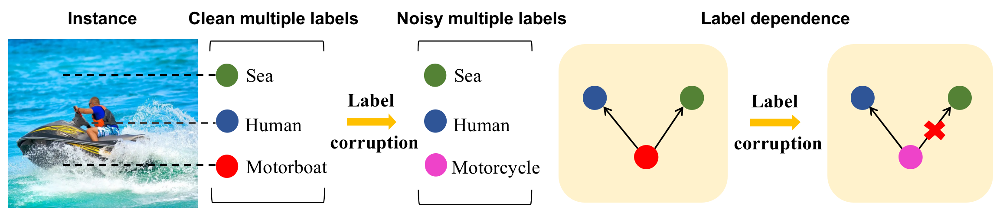

# ICCV‘23: Holistic Label Correction for Noisy Multi-Label Classification.

<div style="text-align: center;">
    
</div>

This is the code for the paper:
[Holistic Label Correction for Noisy Multi-Label Classification](https://openaccess.thecvf.com/content/ICCV2023/papers/Xia_Holistic_Label_Correction_for_Noisy_Multi-Label_Classification_ICCV_2023_paper.pdf).      
Authors: Xiaobo Xia, Jiankang Deng, Wei Bao, Yuxuan Du, Bo Han, Shiguang Shan, Tongliang Liu. 

## Abstract
Multi-label classification aims to learn classification models from instances associated with multiple labels. It is pivotal to learn and utilize the label dependence among multiple labels in multi-label classification. As a result of today’s big and complex data, noisy labels are inevitable, making it looming to target multi-label classification with noisy labels. Although the importance of label dependence has been shown in multi-label classification with clean labels, it is challenging and hard to bring label dependence to the problem of multi-label classification with noisy labels. The issues are, that we do not understand why label dependence is helpful in the problem, and how to learn and utilize label dependence only using training data with noisy multiple labels. In this paper, we bring label dependence to tackle the problem of multi-label classification with noisy labels. Specifically, we first provide a high-level understanding of why label dependence helps distinguish the examples with clean/noisy multiple labels. Benefiting from the memorization effect in handling noisy labels, a novel algorithm is then proposed to learn the label dependence by only employing training data with noisy multiple labels, and utilize the learned dependence to help correct noisy multiple labels to clean ones. We prove that the use of label dependence could bring a higher success rate for recovering correct multiple labels. Empirical evaluations justify our claims and demonstrate the superiority of our algorithm.


## Dependencies
We implement our methods by PyTorch. The environment is as bellow:
- [Ubuntu 16.04 Desktop](https://ubuntu.com/download)
- [PyTorch](https://PyTorch.org/), version >= 0.4.1
- [CUDA](https://developer.nvidia.com/cuda-downloads), version >= 9.0
- [Anaconda3](https://www.anaconda.com/)

Install PyTorch and Torchvision (Conda):
```bash
conda install pytorch torchvision cudatoolkit=10.1 -c pytorch
```

Install PyTorch and Torchvision (Pip3):
```bash
pip3 install torch torchvision
```
## Experiments
      
The used dataset will be downloaded automatically after running the command. Please be aware of network links and storage space. Here is a demo example: 
```bash
python main.py --dataset 2007 --noise_type symmetric --noise_rate 0.3 --c 20
```
The used dataset will be downloaded automatically after the command. Please be aware of network links and storage space.


If you find this code useful in your research, please cite  
```bash
@inproceedings{xia2023combating,
  title={Holistic Label Correction for Noisy Multi-Label Classification},
  author={Xia, Xiaobo and Deng, Jiankang and Bao, Wei and Du, Yuxuan and Han, Bo and Shan, Shiguang and Liu, Tongliang},
  booktitle={Proceedings of the IEEE/CVF International Conference on Computer Vision},
  pages={1483--1493},
  year={2023}
}  
```
